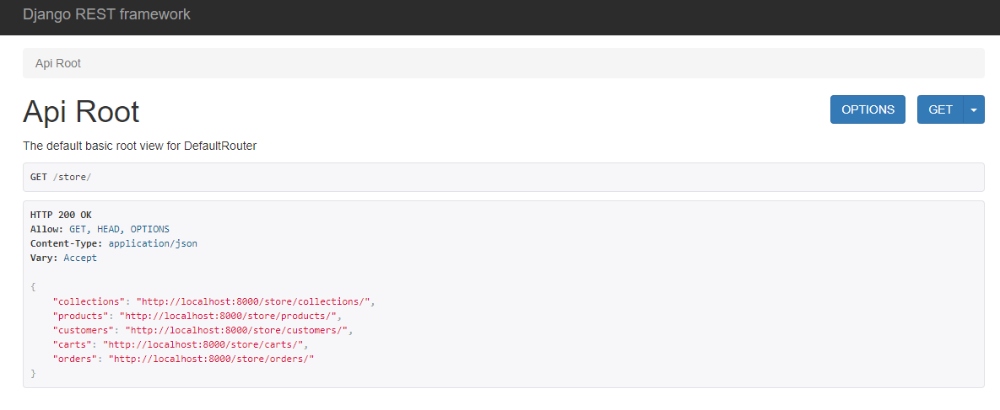
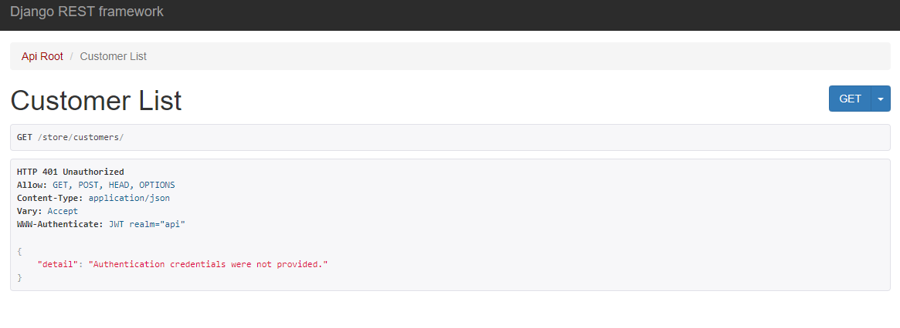

# E-commerce App with Django

This project is a comprehensive e-commerce application built with Django 5.0. It includes various features such as authentication, permissions, an admin site, product image uploads, performance testing, unit testing, caching, and Dockerization. The project follows a modular architecture with independent apps and a generic app for tags.

## Features

- Admin Site: A robust admin interface for managing the application.
- Authentication: User authentication with Djoser and JWT-based authentication.
- Permissions: Fine-grained permissions for different user roles.
- Upload Product Images: Functionality to upload and manage product images.
- Performance Tests: Performance testing using Locust.
- Unit Tests: Comprehensive unit tests with Pytest.
- Caching: Efficient caching with Redis.
- Dockerization: Docker support for easy deployment.

## Authentication

This app uses role based authentication (model authentication) with custom models, the token is required to view some endpoints and perform some tasks. For example, the customer endpoints uses `IsAdminUser` to allow access on all
`/customers` endpoint.

## Groups

The customer service group gives access to the /orders/ and viewing customers. The admin view will change dynamically to match the required group permissions.

